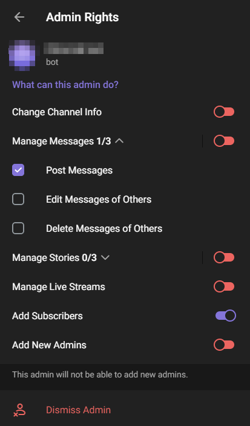
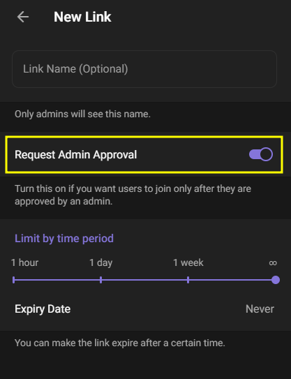

# 🧑‍💻 InviteManager Bot

Automatic acceptance of admission requests to private Telegram channels.

## Installation
```cmd
git clone git@github.com:alex4nder/invite-manager-bot.git
cd invite-manager-bot
yarn install
```


### Environment setup
1. Create a new bot using BotFather and get a token
2. Create a .env file and place the token you received after creating the bot there
    ```
    TOKEN=<token>
    PORT=<port>
    WEBHOOK_URL=<webhook url>
    ```

### Channel setup
1. Create a new private telegram channel
2. Add a new subscriber - your telegram bot. Assign the bot administrator rights with the following accesses:

3. Create a new invite link and send it to users who need access to the channel.

> **IMPORTANT NOTE:** You must create a new invite link with the **Request Admin Approval** option.

### Usage

- Replace ```https://your-server.com``` in ```bot.setWebHook(`https://your-server.com/bot${token}`);``` with your server url.
- Start project:
   ```cmd
   yarn watch
   ```

An example of the message the bot receives when a user submits a new request:
```JSON
{
   "chat":{
      "id":<channel id>,
      "title":"Channel name",
      "type":"channel"
   },
   "from":{
      "id":<user id>,
      "is_bot":false,
      "first_name":"John",
      "last_name":"Doe",
      "username":"johndoe",
      "language_code":"en"
   },
   "user_chat_id":<user chat id>,
   "date":1722017003,
   "invite_link":{
      "invite_link":"https://t.me/+b0M...",
      "name":"Link name",
      "creator":{
         "id":<channel owner id>,
         "is_bot":false,
         "first_name":"Channel",
         "last_name":"Owner",
         "username":"ChannelOwner"
      },
      "pending_join_request_count":1,
      "creates_join_request":true,
      "is_primary":false,
      "is_revoked":false
   }
}
```

